[](https://www.microchip.com)

# DC Motor Control with Constant Speed

The PIC16F18875 features Signal Measurement Timer. This project is an upgrade to [DC motor PWM](https://github.com/microchip-pic-avr-examples/pic16f18875-curiosity-hpc-board-dc-motor-with-pwm), where the PWM duty cycle is adjusted using a potentiometer, but rotation speed is heavily depending on the motor mechanical load.
The presented method is still using a potentiometer as a reference, but the the rotation speed is monitored and kept constant using a closed loop algorithm.

## Related Documentation
- [PIC16F18875 Product Family Page](https://www.microchip.com/design-centers/8-bit/pic-mcus/device-selection/pic16F18875)
- [PIC16F18875 datasheet](http://ww1.microchip.com/downloads/en/DeviceDoc/40001802G.pdf) for more information or specifications.

## Software Used
- MPLAB® X IDE 5.30 or newer [(microchip.com/mplab/mplab-x-ide)](http://www.microchip.com/mplab/mplab-x-ide)
- MPLAB® XC8 2.10 or newer compiler [(microchip.com/mplab/compilers)](http://www.microchip.com/mplab/compilers)
- MPLAB® Code Configurator (MCC) 3.95 or newer [(microchip.com/mplab/mplab-code-configurator)](https://www.microchip.com/mplab/mplab-code-configurator)
- MPLAB® Code Configurator (MCC) PIC10/PIC12/PIC16/PIC18 library v1.79 or newer [(microchip.com/mplab/mplab-code-configurator)](https://www.microchip.com/mplab/mplab-code-configurator)

## Hardware Used
- PIC16F18875 PDIP40 with Curiosity High Pin Count (HPC) Development Board [(DM164136)](https://www.microchip.com/Developmenttools/ProductDetails/DM164136)
- Power supply for the DC motor: 6-12V - depending on the motor
- DC motor: M1 - PAN14EE12AA1 or other similar
- LED: D1 - 5mm white or blue
- NMOS transistor: Q1 - VN2210, TN0604, VN3205, VN0104 or an appropriate one, depending on the motor
- Diode: D1 - 1N4001 or similar
- Phototransistor: Q2 - TEPT5700 or other similar
- Resistors: R1 - 100ohm, R2 - 22kohm, R3 - 47kohm
- Capacitors: C1 - 0.47uF, C2 - 22uF
- 3D printed assembly / other mechanical setup

For other colors LEDs, R1 might be increased in order to keep the current around 10mA.
<br><br>Wiring diagram and connections to Curiosity HPC:
    <br>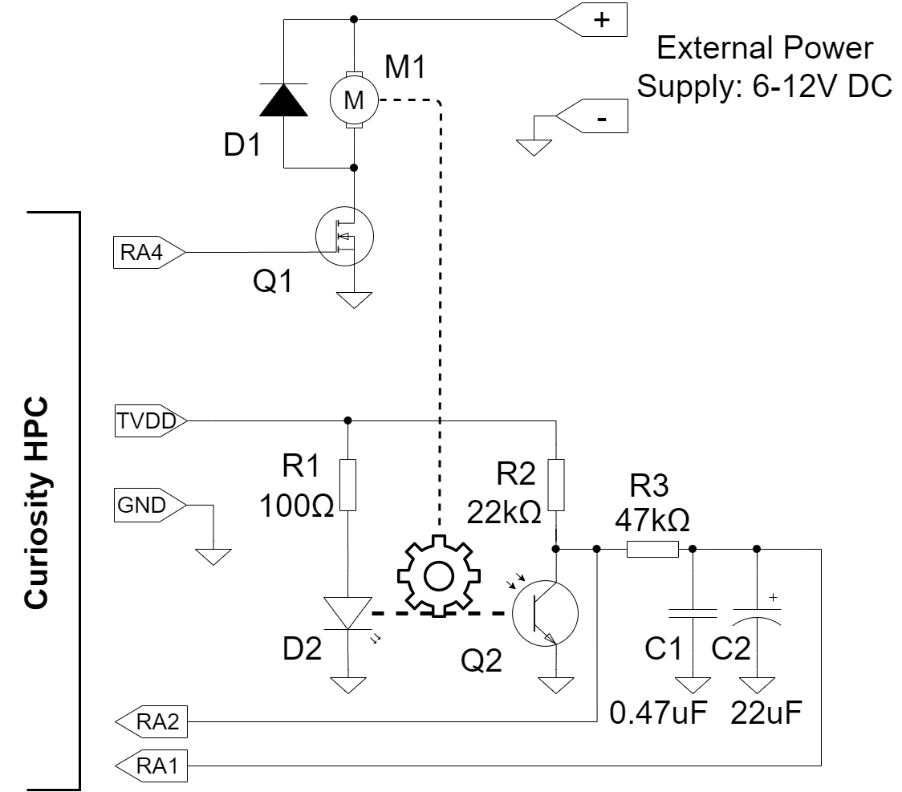


## Setup
- PIC16F18875 MCU is used to measure the rotation speed of the DC motor and to generate the PWM signal.
- The Curiosity HPC board is used as it has got on-board programmer and debugger.
- A 3D printed spinning wheel with 24 holes on its circumference is mounted on the motor shaft.
- A 3D printed case holds the motor in place, and also an LED and a phototransistor that act as an encoder so that when the spinning wheel is rotating, the holes create pulses in the light that gets to the phototransistor, with a frequency that is proportional to the rotation speed.
- An analog comparator within the PIC16F18875 is used condition the signals from the phototransistor and output a square wave.
- Signal Measurement Timer (SMT) is used to measure the period of the square wave. The avantage of the SMT over a normal timer is less user code.
- ADCC is used in low-pass filtering mode to read the value on-board of Curiosity HPC to set a reference for the rotation speed.
- Timer 2 with PWM6 are used to generate a pulse-width modulated signal that proportionally controls the DC motor.
- Timer 4 is used to provide a constant step time for the Proportional-Integral control loop.
- The software within the MCU reads the period value from the SMT, computes the rotation speed using the PI algorithm, then outputs PWM duty cycle value. The reference for the PI is supplied by the potentiometer via ADCC. The calculations are done using floating point arithmetic which is not optimal but easy to understand and modify.
- With a proper adjustment of the PI coefficients, the result is that the rotation speed stays constant and does not depend on the motor load.

### MCC Setup
This section shows the settings used in the demo for PIC16F18875 modules.
These were done using the Microchip Code Configurator (MCC). Open MCC to configure the modules:

### System Module Settings
The MCU uses the high frequency internal oscillator (HFINTOSC), and the clock is set to 32 MHz. 
Watchdog Timer is not used in this demo, so it is disabled.
    <br>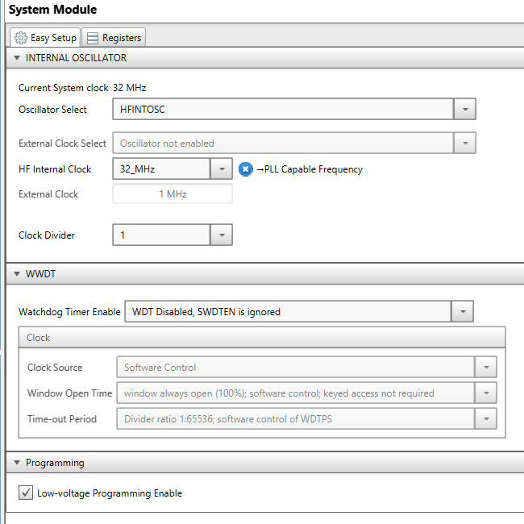

### ADCC Settings
ADCC is used to read the potentiometer. 
It is configured to operate in Low pass filter mode, with a clock of Fosc/128.
    <br>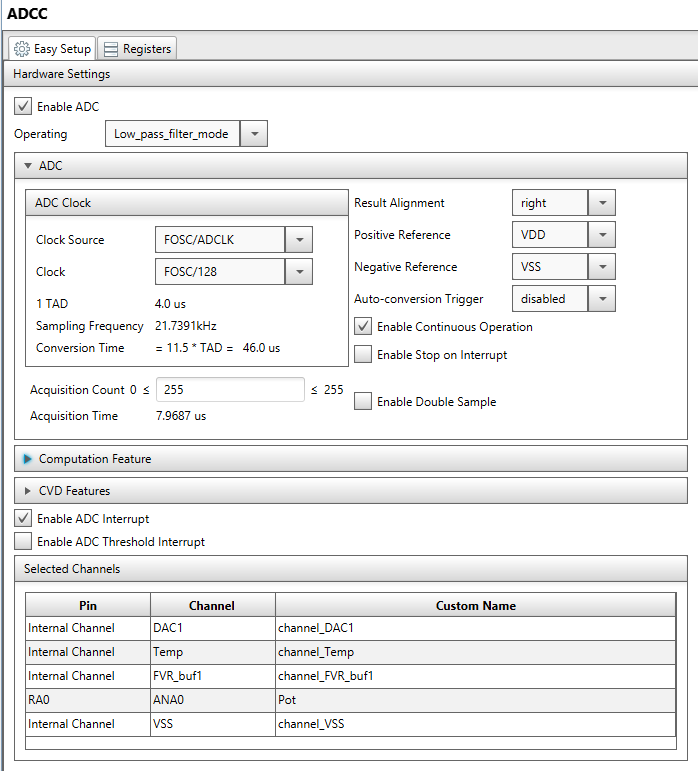

### TMR2 Settings
The TMR2 is used as a period source for the PWM signal.
From Device Resources add TMR2 peripheral, configure it with the following options:
    <br>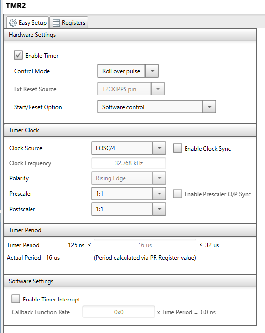 

### TMR4 Settings
The TMR4 is used as a precision time reference for the PI algorithm, by producing an interrupt every 20ms.
From Device Resources add TMR4 peripheral, configure it with the following options:
    <br>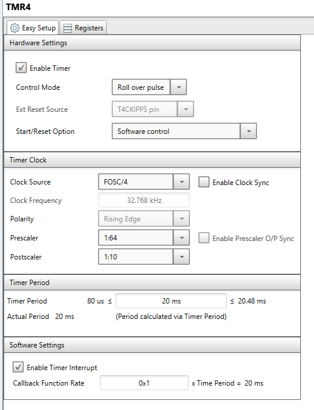 

### PWM6 Settings
The PWM6 is used to generate the PWM signal for the motor. It uses the TMR2 as period source. 
The duty cycle is updated at runtime according to the output of the PI.
From Device Resources add PWM6 peripheral, configure it with the following options:
    <br>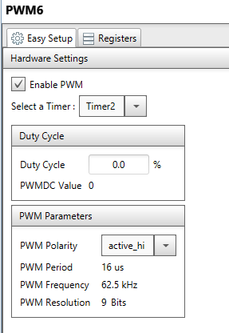 

### CMP1 Settings
The CMP1 analog comparator is used to read the phototransistor and output a square wave.
From Device Resources add CMP1 peripheral, configure it with the following options:
    <br>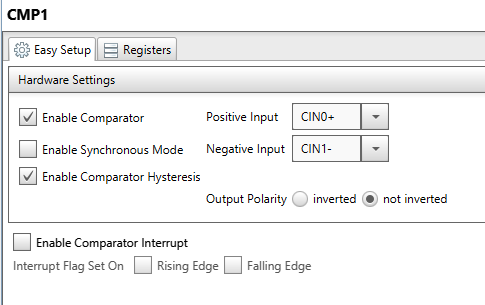 

### SMT1 Settings
The Signal Measurement Timer is configured in Period and Duty-Cycle Acquisition mode, with the signal coming from the output of the CMP1. The SMT1 has MFINTOSC/16 set as clock source, so it will count in steps of 32 microseconds. 
Other clock sources can be selected depending on the range of the measured signal.
From Device Resources add SMT1 peripheral, configure it with the following options:
    <br>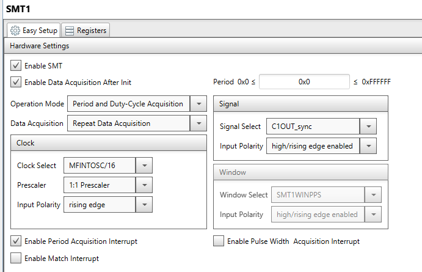 

### Interrupt Settings
From Project Resources select Interrupt manager, configure it with the following options:
    <br>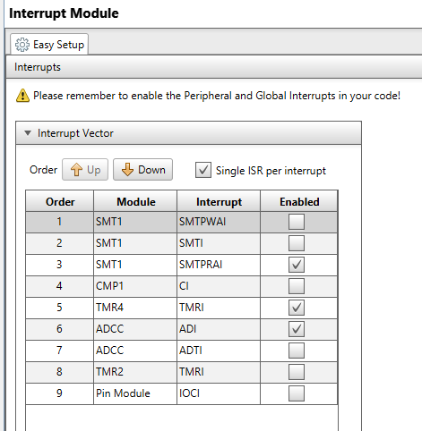 

### Pin Module Settings
From Project Resources select Pin Module, configure it with the following options:
    <br>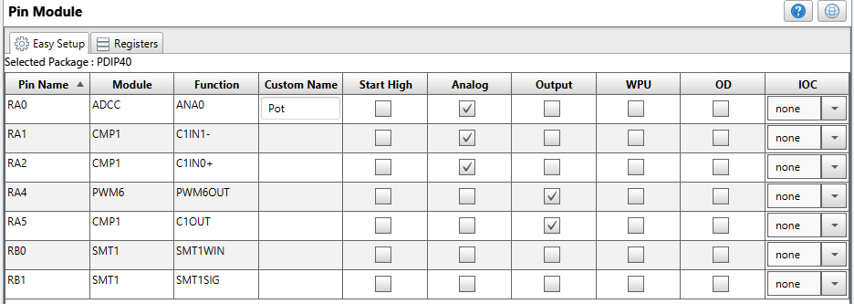 

### Pin Manager Settings
In the Pin Manager, verify the following options:
    <br>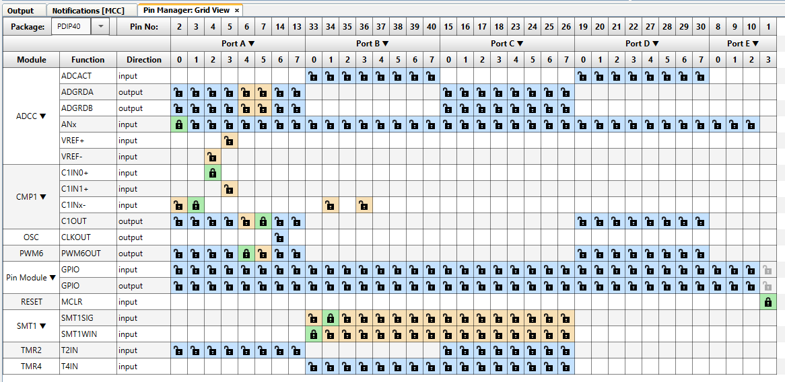 

The following pin configurations must be made for this project:

|Pin           | Configuration       |
| :----------: | :-----------------: |
|RA0           | Analog ADCC input   |
|RA1           | CMP1 negative input |
|RA2           | CMP1 positive input |
|RA4           | Digital PWM6 output |
|RA5           | CMP1 output D3 LED  |


### Demo Code
The source code for this project can be downloaded from the current page by clicking the "Download" button, or if you want to make your own project, please pay attention to the following steps:

- After making the MCC Settings, press the "Generate" button, and it will generate the required C and header files.
- Then edit by adding two lines of code into the "smt1.c" file. First one, at the beginning, after include section:
```
extern volatile uint32_t sharedPeriod;
```

- Then, second one, into SMT1_PR_ACQ_ISR function:
```
void SMT1_PR_ACQ_ISR(void)
{
    // new added line
    sharedPeriod = SMT1_GetCapturedPeriod();
    // Disabling SMT1 period acquisition interrupt flag bit.
    PIR8bits.SMT1PRAIF = 0;
}
```

- Also in the "main.c" file, don't forget to enable the interrupts by uncommenting these lines:
```
    // Enable the Global Interrupts
    INTERRUPT_GlobalInterruptEnable();

    // Enable the Peripheral Interrupts
    INTERRUPT_PeripheralInterruptEnable();
```

The flow diagram is presented in the picture below:
    <br>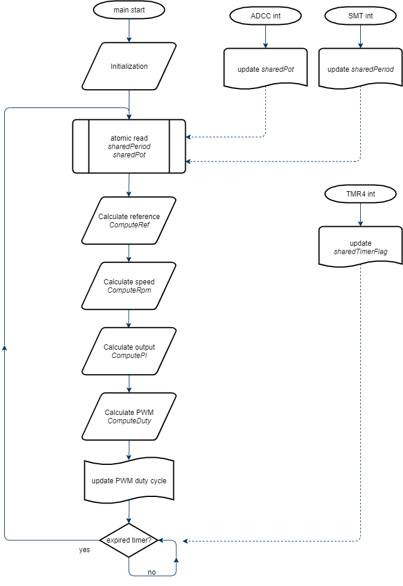

The proportional-integral diagram is presented in the picture below:
    <br>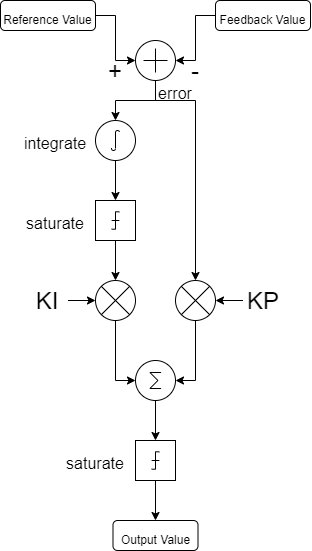

## Operation
- The 3D printed parts are presented in the picture below:
    <br>

- Mount the spinning wheel on the motor shaft.
- Mount the motor, LED and phototransistor inside the 3D printed case 
- Assemble it using M3 bolts and nuts. See the picture below for refference
    <br>

- Make the connections according to the schematic presented.


1. After making the above hardware connections, connect the Curiosity HPC board to PC using the USB cable.
2. Build demo firmware and load the generated hex file onto the PIC16F18875 MCU.
3. Rotate the potentiometer to adjust the DC motor speed.
4. Increase the load on the motor and notice the PWM duty cycle increases (D2 LED becomes brighter) in order to keep the speed constant.

## Summary

This project showcases how easy it is to use the Signal Measurement Timer of the PIC16F18875 and MCC to measure the speed of a motor and create a feedback loop in order to keep the speed constant.